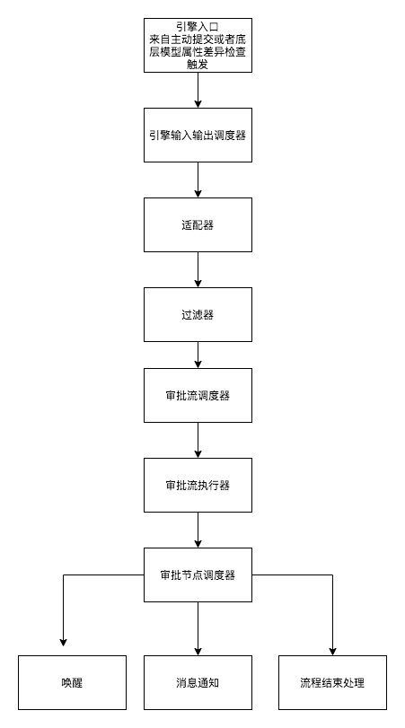

### 流程图示

1 审批引擎 采用php特性引入业务底层领域模型

2 在beforeSave afterSave 或者 调度的行为中埋点  产生审批信号，分为触发类型和中断类型

3 审批流引擎调度器，检查当前环境，初始化常量，接受信号量移交适配器，处理异常交互

4 适配器根据信号量关联的业务模型类型权重过滤出适配的配置

5 过滤器根据信号量和配置设置的流程条件和步骤条件进行筛选，现阶段采用的是组装sql依赖数据库的能力进程筛选

6 返回合适审批配置和步骤条件，根据信号量移交给审批流执行器，执行器生成申请单，调度审批节点调度器生成节点和审批单

7 申请单 审批单 审批节点就绪之后等待用户审批事件，转交同意拒绝撤回系统停止等事件

8 节点结束由驱动器检查是否是否有下一个适配的步骤，有的话继续调用节点调度器生成节点和审批单，没有则转移到结束状态

9 结束状态，是否需要执行唤醒worker，流程配置的结束态的处理句柄

10 中间事件记录，事件发布监听